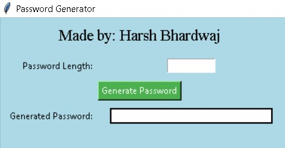
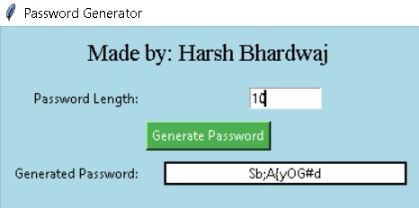

# Password Generator App 💻🔐

Welcome to the Password Generator App! This simple yet powerful tool can help you create strong and secure passwords in just a few clicks.

## Made by: Harsh Bhardwaj

Harsh Bhardwaj has developed this handy application to ensure your digital security. With a user-friendly interface built using Tkinter, generating a password has never been easier or more fun!

## Screenshots




## Features 🌟

- **Simple Interface**: The app features a clean and intuitive interface that is easy on the eyes and straightforward to use.
- **Customizable Length**: You can specify the exact length of your desired password.
- **Secure Passwords**: Generates passwords that include a mix of uppercase and lowercase letters, numbers, and symbols.
- **Error Handling**: Provides helpful error messages if you enter invalid input.

## How to Use 🛠️

1. Enter the desired password length in the provided entry box.
2. Click the 'Generate Password' button.
3. Your newly generated password will appear on the screen.

## Requirements 📋

- Python 3.x
- Tkinter library (usually comes with Python)

## Installation 🔧

To run the Password Generator App, clone this repository or download the `PasswordGeneratorApp.py` file and run it in your Python environment.

```bash
git clone https://github.com/your-username/PasswordGeneratorApp.git
cd PasswordGeneratorApp
python PasswordGeneratorApp.py
