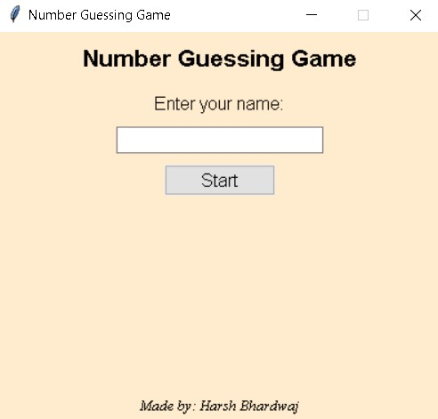
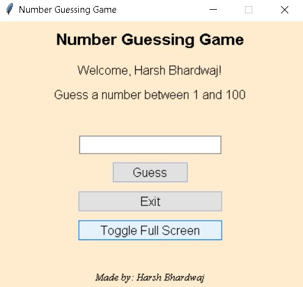
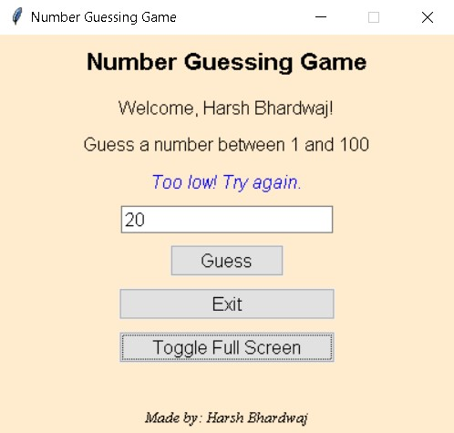
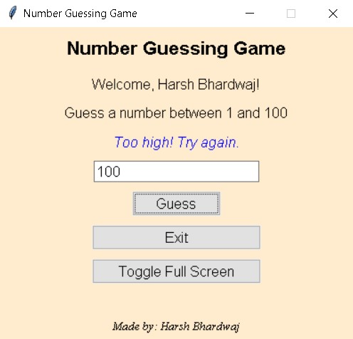
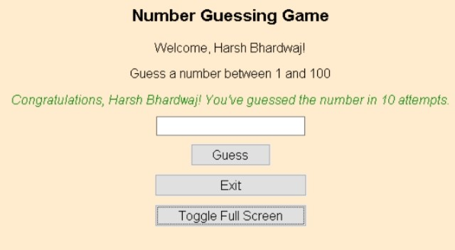

# Number Guessing Game 🎲

This is a simple command-line game where the program generates a random number between 1 and 100, and the player needs to guess the number. The program will provide feedback on whether the player's guess is too high or too low until the correct number is guessed. 🔢

## Screenshots

 
 

## Getting Started 🚀

To play the game, follow these steps:

1. Clone the repository or download the source code.
2. Navigate to the project directory.
3. Compile the source code using a C compiler (e.g., `gcc` for Linux/macOS or `cl` for Windows).
4. Run the compiled executable.

## How to Play 🕹️

1. When the game starts, you will be prompted to enter a guess between 1 and 100.
2. After entering your guess, the program will provide feedback:
  - If your guess is too high, it will display "Too high! ⬆️"
  - If your guess is too low, it will display "Too low! ⬇️"
  - If you guess the correct number, it will display "Congratulations! You guessed the number! 🎉"
3. Continue guessing until you find the correct number.

## Contributing 🤝

Contributions to this project are welcome. If you find any issues or have suggestions for improvements, please open an issue or submit a pull request.

## License 📄

This project is licensed under the [MIT License](LICENSE).

